# 千手マネージャ・千手ブラウザ・千手エージェントのインストール
## はじめに
本記事では Microsoft Azure 上に仮想マシンを2台作成し、一台に千手エージェントをインストールし、もう一台に千手エージェント・千手ブラウザをインストールする方法を紹介します。本記事を通して作成される成果物の構成は以下になります。


## Microsoft Azure のリソース作成
千手マネージャ、千手ブラウザ、千手エージェントをインストールするための事前準備として、仮想ネットワークと仮想マシン（Windows Server 2012 R2）×2 を作成します。

### 仮想ネットワークの作成
管理ポータルから「新規 - ネットワーキング - 仮想ネットワーク」を選択し、Microsoft Azure 上に以下のパラメータを入力して仮想ネットワークを作成します。

| 名前 | アドレス空間 | サブネット名 | サブネットアドレス範囲 | サブスクリプション | リソースグループ | 場所 |
| - | - | - | - | - | - | - |
| senju-vnet | 127.19.0.0/16（アドレス空間が 65536 アドレスなら任意で問題ない） | SENJU-SUBNET| 172.19.0.0/24 | （自サブスクリプション） | senju-dev-rg（新規で作成） | 東日本（任意） |


次に、作成した仮想ネットワークにサブネットを追加で作成します。管理ポータルから、作成した仮想ネットワークを選択し、「サブネット」メニューを選び「+サブネット」を押下し、以下のパラメータを入力して設定を保存します。

| 名前 | アドレス範囲（CIDR ブロック） | ネットワークセキュリティグループ | ルートテーブル |
| - | - | - | - | 
| AP-SUBNET | 172.19.1.0/24 | なし | なし |


上記を実施することで、千手マネージャ向けの Windows Server 2012 R2、千手エージェント向けの Windows Server 2012 R2 をデプロイする環境が完了しました。

### Windows Server 2012 R2 の作成 - 千手マネージャ用
管理ポータルから「新規 - Compute」を選択し、「Windows Server 2012 R2 Datacenter」を選択します。まず「基本」に対し、以下の情報をインプットします。

| 名前 | VMディスクの種類 | ユーザ名 | パスワード | パスワードの確認 | サブスクリプション | リソースグループ | 場所 |
| - | - | - | - | - | - | - | - |
| SenjuMGWinVM | SSD | azureuser | （任意） | （任意） | （自サブスクリプション） | senju-dev-rg（既存のものを使用） | 東日本（任意） |

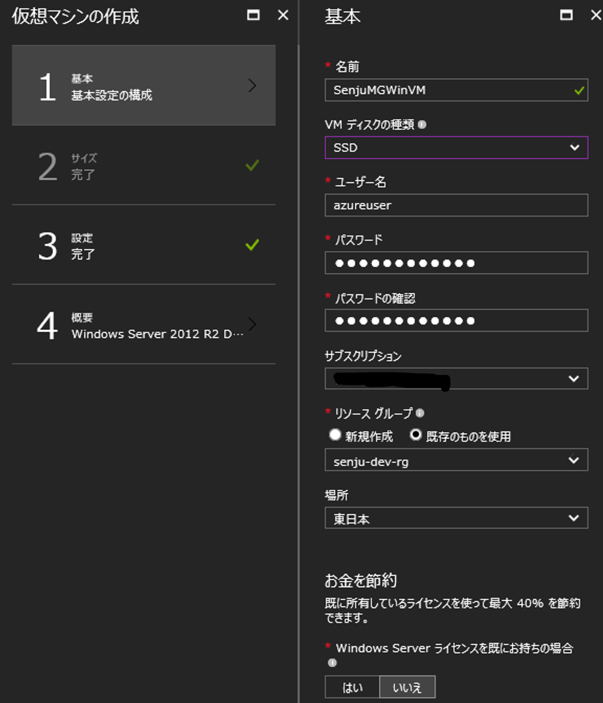

次に「サイズ」では以下の様に DS1_V2 を選択します。インスタンスサイズは必要に応じて変更してください。

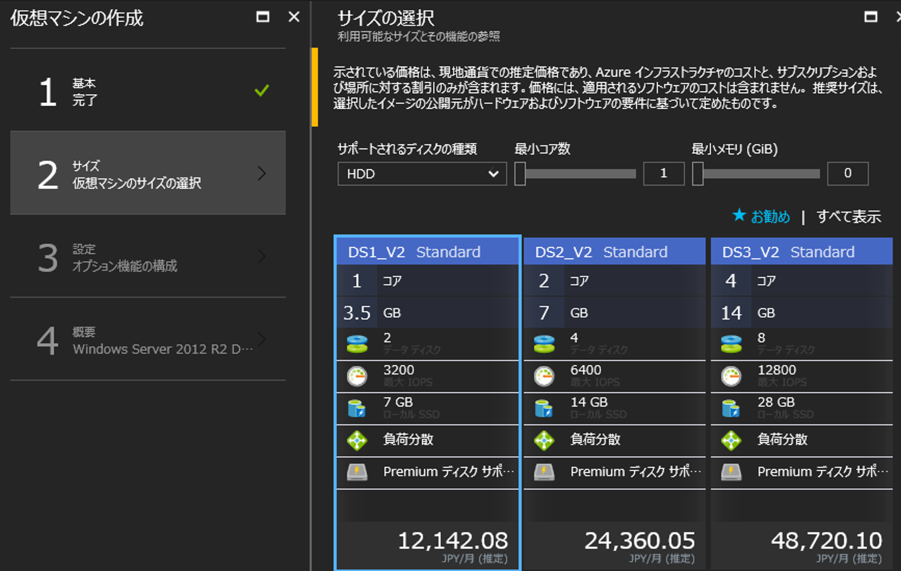

次に「設定」では以下の情報を入力します。

| 管理ディスクを使用 | ネットワーク | サブネット | パブリックIPアドレス | ネットワークセキュリティグループ | 拡張機能 | 可用性セット | ブート診断 | ゲストOSの診断 | 診断ストレージアカウント |
| - | - | - | - | - | - | - | - | - | - |
| はい | senju-vnet | SENJU-SUBNET | （新規） | （新規） | 拡張機能なし | なし | 有効 | 無効 | （新規） |

入力の完了後、パラメータを確認して仮想マシンを作成してください。


### Windows Server 2012 R2 の作成 - 千手エージェント用
管理ポータルから「新規 - Compute」を選択し、「Windows Server 2012 R2 Datacenter」を選択します。まず「基本」に対し、以下の情報をインプットします。

| 名前 | VMディスクの種類 | ユーザ名 | パスワード | パスワードの確認 | サブスクリプション | リソースグループ | 場所 |
| - | - | - | - | - | - | - | - |
| SenjuAgentWinVM | SSD | azureuser | （任意） | （任意） | （自サブスクリプション） | senju-dev-rg（既存のものを使用） | 東日本（任意） |

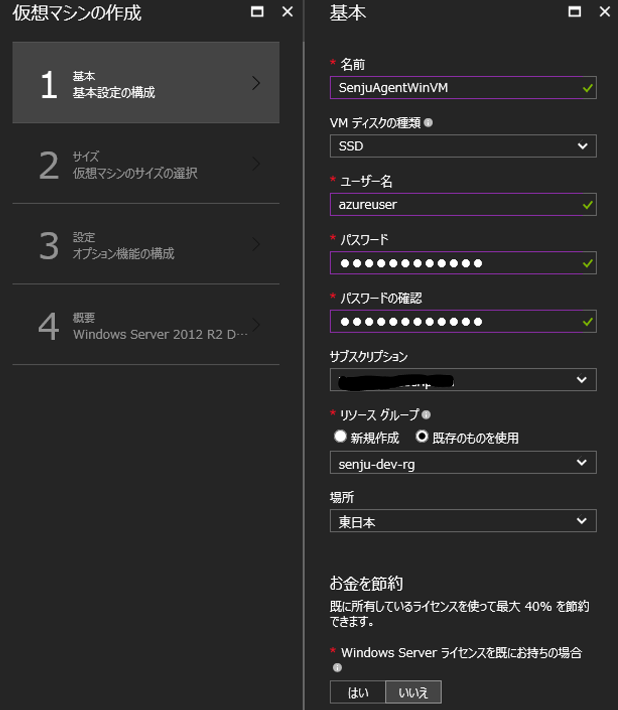

次に「サイズ」では以下の様に DS1_V2 を選択します。インスタンスサイズは必要に応じて変更してください。

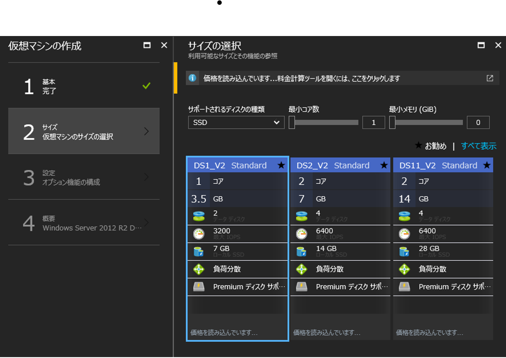

次に「設定」では以下の情報を入力します。

| 管理ディスクを使用 | ネットワーク | サブネット | パブリックIPアドレス | ネットワークセキュリティグループ | 拡張機能 | 可用性セット | ブート診断 | ゲストOSの診断 | 診断ストレージアカウント |
| - | - | - | - | - | - | - | - | - | - |
| はい | senju-vnet | AP-SUBNET | （新規） | （新規） | 拡張機能なし | なし | 有効 | 無効 | （作成済ストレージ） |

入力の完了後、パラメータを確認して仮想マシンを作成してください。


### Windows Server 2012 R2 の日本語化、ファイヤウォールの無効化

https://docs.com/isami-daichi-1/5452/sqlserver2016-windowsserver2016-20170213 の P.15 ～ P.26 を参照してください。


### プライベート IP アドレスの固定化

千手を利用する場合、固定の IP アドレスの設定を行い、千手マネージャがインストールされたサーバの hosts ファイルへの記載が必要になります。Microsoft Azure で IP アドレスを固定する場合、管理ポータルからの設定が必要になります。

当該仮想マシンのネットワークインターフェースを選択して「IP 構成」から以下の画面を参考に静的なプライベート IP を設定してください。Microsoft Azure の仮想マシンに関する IP アドレス割り振りに関しては [Azure の仮想マシンとIPアドレス](https://blogs.technet.microsoft.com/mskk-cloudos/2016/04/06/azure-ip/ "Azure の仮想マシンとIPアドレス") を参照ください。


今回のサンプルでは以下の様に IP アドレスを割り振っています。

| VM 名前 | プライベート IP アドレス |
| - | - |
| SenjuManagerVM | 172.22.0.10(静的) |
| SenjuAgentWinVM | 172.22.1.4(静的) |

以上で Microsoft Azure 上でのリソース配置は完了です。次節からは千手の具体的なインストール手順となります。

## hosts ファイルの編集


```
SenjuMGWinVM	172.19.0.10	# Senju Manager
SenjuAgentWinVM	172.19.1.10	# Senju Agent
```


## 千手エージェントのインストール
まず、監視対象となる Windows Server 2012 R2 に千手エージェントのインストールを行います。こちらの内容について、詳細な手順は以下のマニュアルに記載されています。ここでは簡易的な内容を紹介いたします。
5.2. Windows版千手エージェント Senju DevOperation Conductor Document Disk/doc/install_guide/05.html#windows

まず、Windows 向けのバイナリとして提供されている以下のファイルを利用します（細かなファイル名は千手のリリース時期によって変わる場合があります）。
Senju DevOperation Conductor Disk\windows.agt\package\senju_agt-1600-00-windows-x86-20160708.exe

こちらを監視対象の仮想マシンにリモートデスクトップを利用したクリップボードコピー等で配置し、当該仮想マシン上でインストーラを実行します。利用する言語を選択画面が起動するので、今回は「日本語」を選択します。

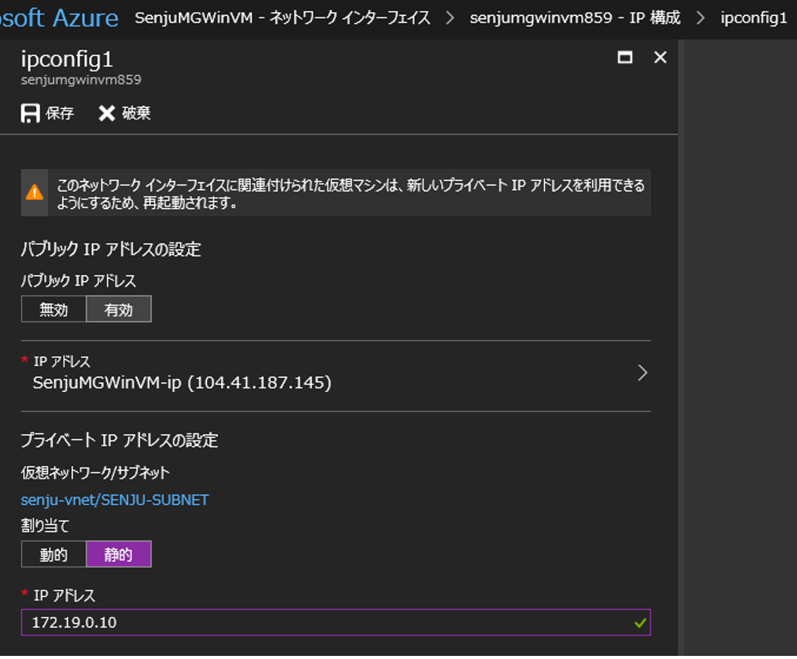

次に、セットアップに必要な再配布パッケージのインストールが求められるので、こちらも「はい」を押下します。


セットアップウィザードの開始ダイアログは「次へ」を押すだけで問題ありませんが、以下の千手サービスアカウントに今回は「ローカルシステムアカウント（LocalSystem）」を選択します。Active Directory をインストール済の Windows Server が存在する場合等は、別途アーキテクチャを検討してください。

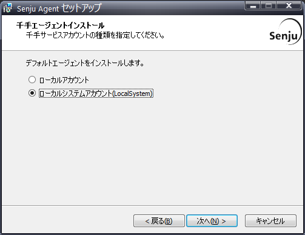

さらに、ここで千手のノードIDと千手ロングホスト名を入力します。今回は単純にコンピュータ名をそのまま以下の様に付与します。

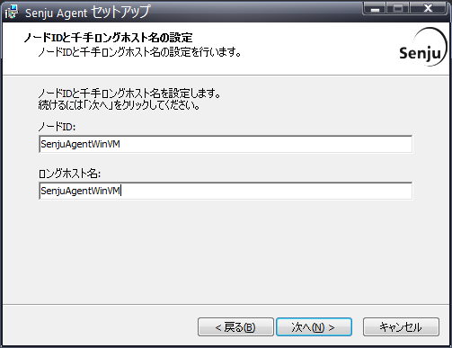

次に、監視元の千手ドメイン名を記載します。こちらは後程の「千手マネージャ」のインストール時に別途指定しますが、ここでまず以下の様に「SenjuMGWinVM」を入力してください。


後はインストール先の指定がありますが、特に変更する必要はないのでウィザード通りにセットアップを完了してください。


## 千手マネージャのインストール
次に Windows 版の千手マネージャをインストールします。こちらの詳細な手順は以下のマニュアルに記載がありますので、簡易的な内容だけ記載します。
4.2. Windows版千手マネージャ Senju DevOperation Conductor Document Disk\doc\install_guide\04.html#windows

まず、Windows 向けのバイナリとして提供されている以下のファイルを利用します（細かなファイル名は千手のリリース時期によって変わる場合があります）。
Senju DevOperation Conductor Disk\windows.mgr\package\senju_mgr-1600-00-windows-x86-20160527.exe

こちらを千手マネージャをインストールする仮想マシンにリモートデスクトップを利用したクリップボードコピー等で配置し、当該仮想マシン上でインストーラを実行します。利用する言語を選択画面が起動するので、今回は「日本語」を選択します。


セットアップに必要な再配布パッケージのインストールが求められるので、こちらも「はい」を押下します。


千手マネージャを動作させるローカルアカウントを作成します。今回は senju/（任意） でアカウントを作成します。


千手マネージャが管理する千手ドメインを作成します。千手エージェントセットアップ時に指定した「SenjuMGWinVM」を指定してください。

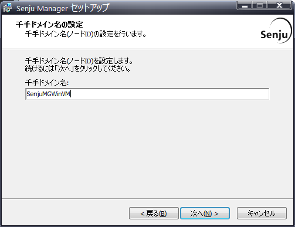

後はインストール先の指定がありますが、特に変更する必要はないのでウィザード通りにセットアップを完了してください。通常はラインセス登録を行う必要がありますが、今回はトライアルとしてセットアップを完了します。


## 千手ブラウザのインストール

次に 千手ブラウザをインストールします。まず、Windows 向けのバイナリとして提供されている以下のファイルを利用します（細かなファイル名は千手のリリース時期によって変わる場合があります）。

Senju DevOperation Conductor Disk\windows.brw\package\senju_brw-1600-00-windows-x86-20160426.exe

こちらを千手ブラウザをインストールする仮想マシン（千手マネージャをインストールした仮想マシンになります）にリモートデスクトップを利用したクリップボードコピー等で配置し、当該仮想マシン上でインストーラを実行します。利用する言語を選択画面が起動するので、今回は「日本語」を選択します。

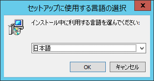

その後、インストール先フォルダ、コンポーネントの選択等を行いますが、既定の値のままセットアップを実施します。


## 千手ブラウザでの監視ノードの追加
千手ブラウザを利用し、千手マネージャから監視する千手エージェントを追加する設定を行います。こちらの手順は以下に詳細な記載があるので、本節では簡易的な手順を紹介します。
2.3.1.4. 管理対象ノードの登録と削除 Senju DevOperation Conductor Document Disk/doc/users_guide/02_3.html#id12

まず、千手マネージャ、千手ブラウザをインストールした仮想マシンでメニューより「Senju Browser(日本語)」を選択し、千手ブラウザを以下の様に起動してください。起動後、ドメイン名には「SenjuMGWinVM」を入力し、ユーザ名・パスワードはマニュアルを参照して入力してください。

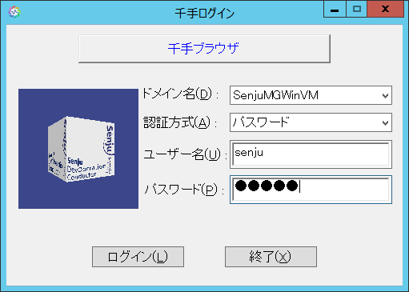

ログイン後、以下の様な千手ブラウザのアプリケーションが起動します。

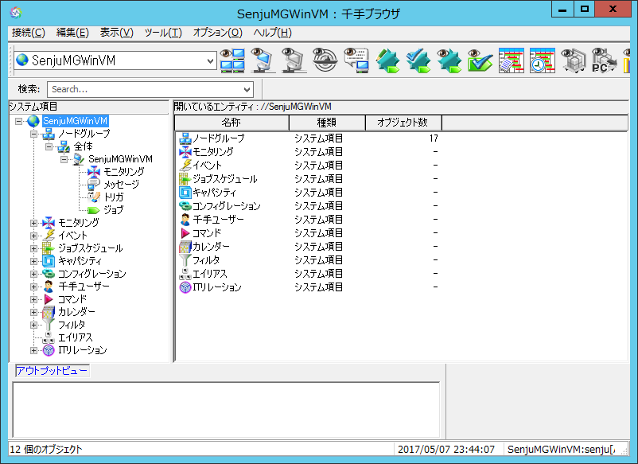

千手ブラウザの左メニューから "ドメイン名" - ノードグループ - 全体 を選択後、以下の画面を参考に右側のウィンドウで右クリックを押下して 新規作成 - 千手エージェント を選択します。

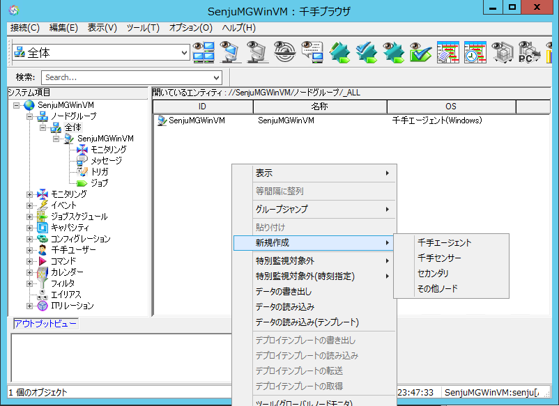

以下のダイアログが起動するので、千手エージェントをインストールした仮想マシンの情報を入力します。「千手エージェント（Windows）」を選択し、ノードID、ロングホスト名はセットアップ時の値を入力してください。

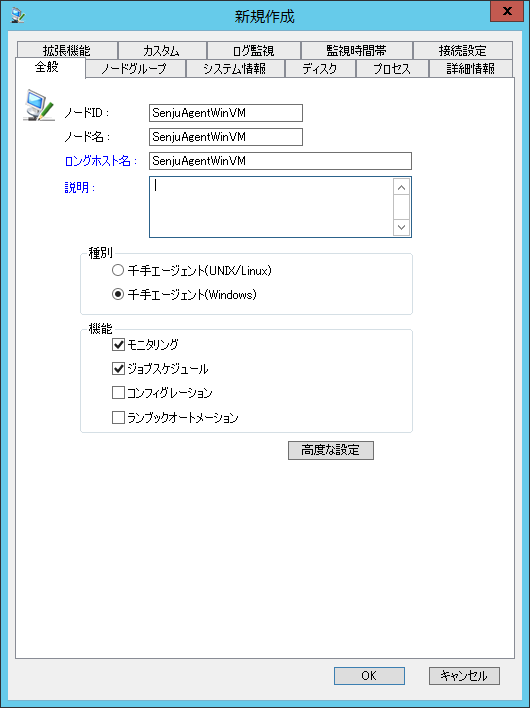

監視ノードを追加後、千手ブラウザの左メニューから "ドメイン名" を右クリックし、メニューから「反映（ノード定義）」を実行してください。正常にコマンドが実行されれば、以下の様に「ノード状態（千手）」の値が「正常」になります。

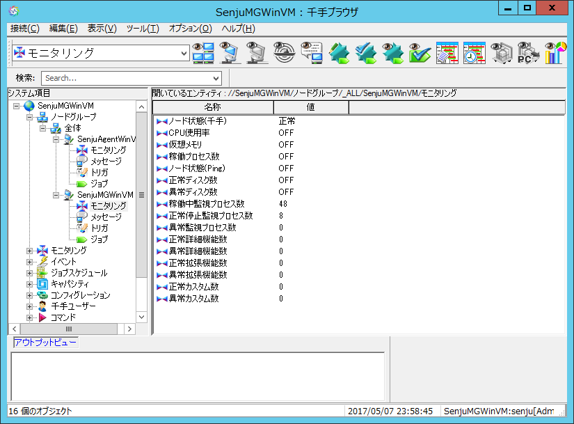

以上でセットアップは完了です。


